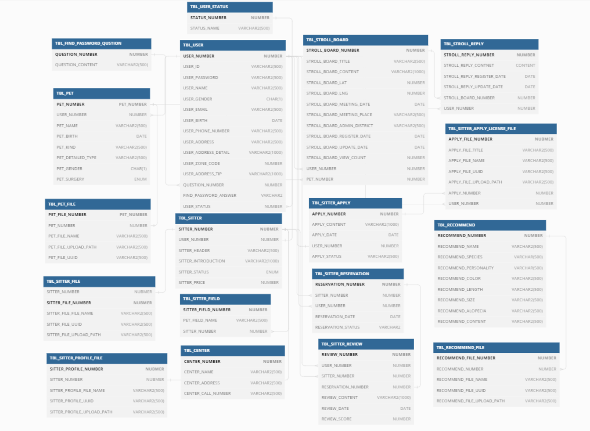

# 팀명 : NPE 단속반

# 프로젝트 이름 : happy-pets-day

## 프로젝트 주제

반려동물에 관한 여러 서비스를 제공하는 사이트입니다.

## 팀 구성
|이건희 (팀장)|김대연 (부팀장)|박광인|서지민|이정현|조상수|
|:-:|:-:|:-:|:-:|:-:|:-:|
|[@lee-geon-hee](https://github.com/lee-geon-hee)|[@gimdaeyeon](https://github.com/gimdaeyeon)|[@decoy8080](https://github.com/decoy8080)|[@Jmsuhhh](https://github.com/Jmsuhhh)|[@leejh1118](https://github.com/leejh1118)|[@sangsucho](https://github.com/sangsucho)|

## ERD구성

## ⚙️ 개발 환경
- Java
- SpringBoot
- IntelliJ
- Mybatis
- Oracle

## 📌 내가 맡은 기능 - 회원가입/로그인, 아이디/비밀번호찾기, 입양동물 목록

### 📖 회원가입/로그인
- 정규표현힉 사용
- 카카오 주소 api 사용
- 아이디 중복 체크
- 아이디 저장

### 📖 아이디/비밀번호 찾기
- 이름, 핸드폰번호로 아이디 찾기
- 아이디, 보안질문, 답변으로 비밀번호 찾기

### 📖 입양동물 목록
- 서울시 공공데이터 api 입양동물 목록 가져오기
- 고양이/ 강아지 목록 분류
- 동물 검색 기능

